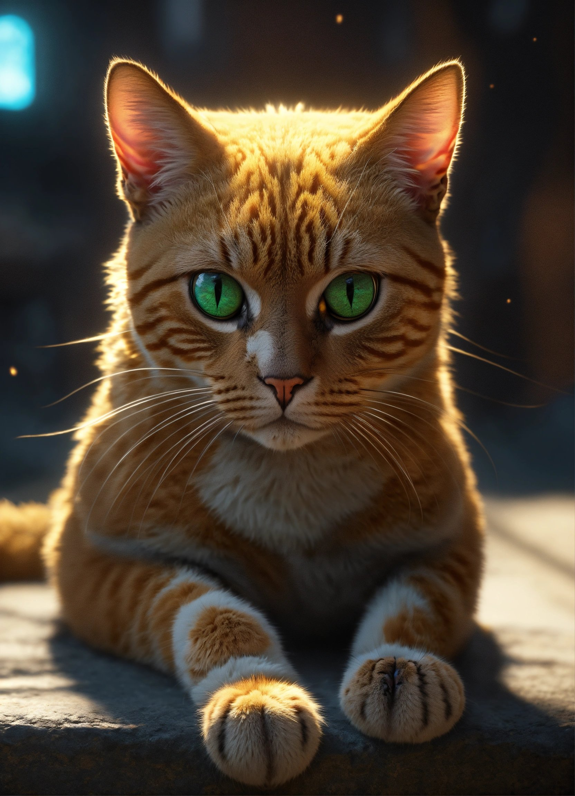
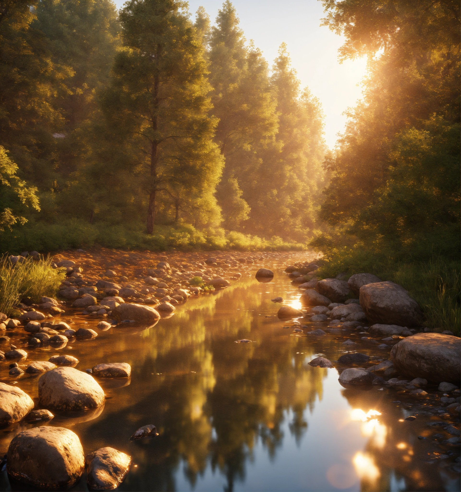
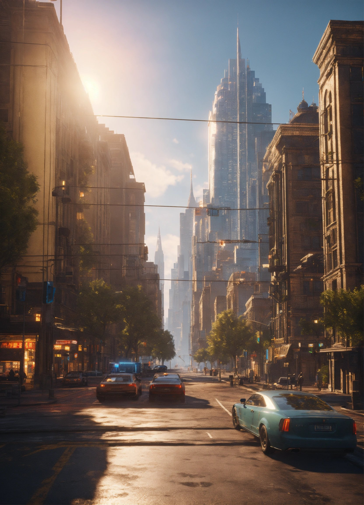
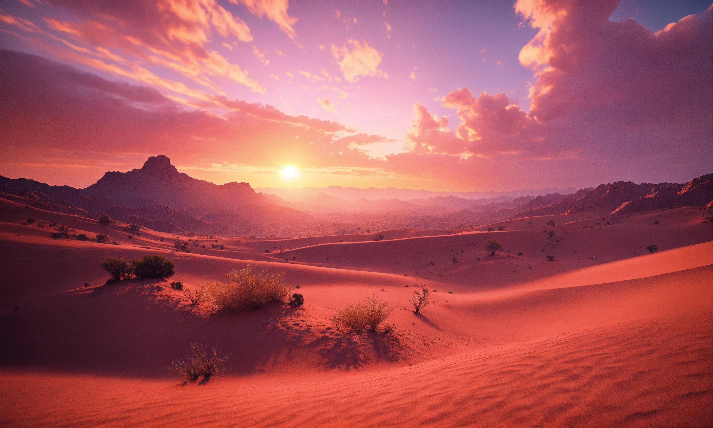
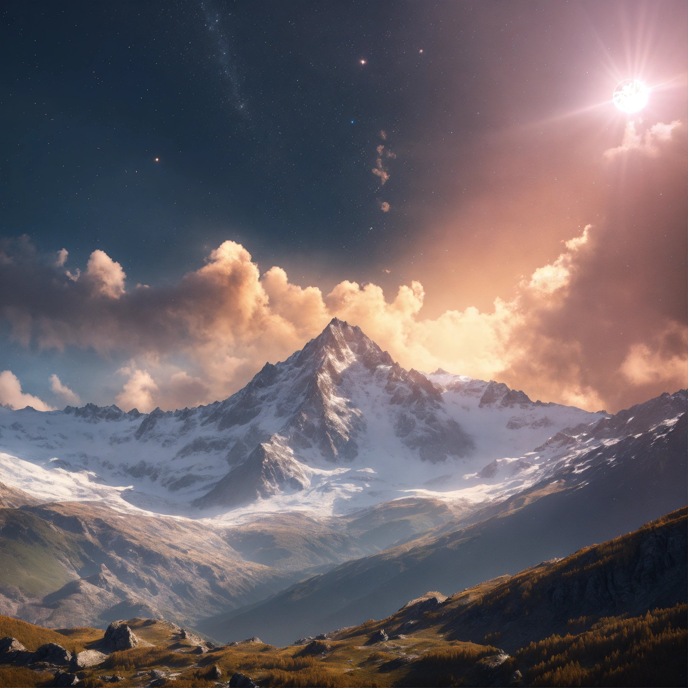

# Projeto de Geração de Imagens com IA

## 📒 Descrição
Este projeto combina técnicas de inteligência artificial (IA) e ferramentas de geração de conteúdo para criar imagens realistas. 
As imagens realistas foram geradas pelo [Lexica.art](https://lexica.art/]).

## 🤖 Tecnologias Utilizadas
- [Lexica.art](https://lexica.art/): Criação de imagens realistas utilizando algoritmos avançados de IA para produzir paisagens, retratos e cenários visualmente impressionantes.

## 🚀 Imagens Geradas

Aqui estão algumas das imagens realistas geradas durante o projeto:

---
